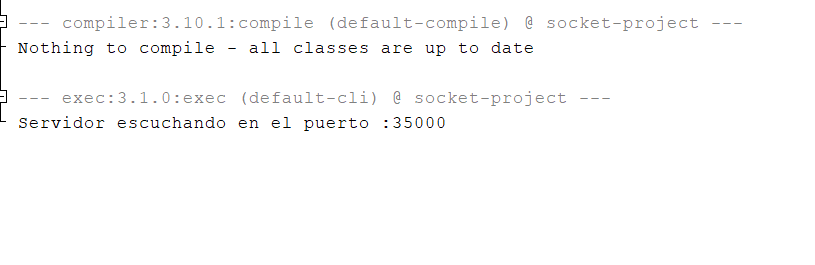
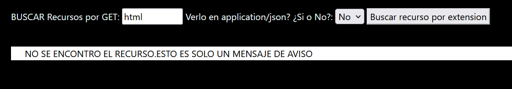
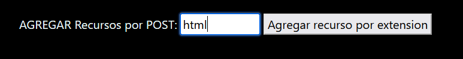
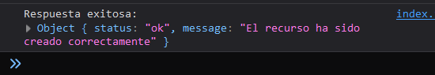
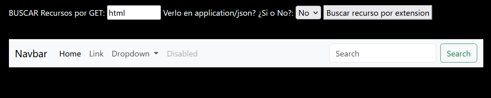

# LAB 3 AREP - MICROFRAMEWORKS - WEB

En este taller se explorará la arquitectura de las aplicaciones distribuidas. Concretamente, exploraremos la arquitectura de los servidores web y el protocolo HTTP sobre el que están soportados.

## Reto

Escriba un servidor web que soporte múltiples solicitudes seguidas (no concurrentes). El servidor debe leer los archivos del disco local y retornar todos los archivos solicitados, incluyendo páginas HTML, archivos JavaScript, CSS e imágenes. Construya una aplicación web con JavaScript, CSS e imágenes para probar su servidor. Incluya en la aplicación la comunicación asíncrona con unos servicios REST en el backend. NO use frameworks web como Spark o Spring, use solo Java y las librerías para manejo de la red.

## Empezando

Estas instrucciones te permitirán obtener una copia del proyecto y ejecutarlo en tu máquina local con fines de desarrollo y pruebas. Consulta la sección de implementación para obtener notas sobre cómo desplegar el proyecto en un sistema en vivo.

### Prerequisitos

¿Qué cosas necesitas instalar para el software?

- Un navegador (preferiblemente Mozilla o Chrome).
- Un IDE como NetBeans para poder arrancar el servidor (Nota: Hay otras maneras).
- GitBash para clonar el proyecto en tu computadora.

### Instalación

Una serie de pasos a seguir para configurar un entorno de desarrollo.

1. Clonar este repositorio en tu computadora.
2. Encontrarás dos carpetas, server-web y client-web.
3. Puedes abrir server-web desde NetBeans y ejecutar main.java.
4. Abrir el cliente:
   - Si tienes una extensión en Visual Studio Code, puedes usarla para abrir un puerto y acceder a la página de la siguiente manera, por ejemplo: http://127.0.0.1:5500/index.html.
   - De manera más sencilla, simplemente abre index.html desde la carpte dandole ABRIR CON  en Mozilla o Chrome.

## Ejecución de las pruebas

Explica cómo ejecutar las pruebas automatizadas para este sistema.

### Desglose de pruebas de extremo a extremo

Explica qué prueban estas pruebas y por qué.

#### Pruebas con fundamentos de finalización

Solucion Plateada: Con el metodo POST lo que hacemos es agregar el recurso y con el metodo GET lo que hacemos es buscar ese recurso y traerlo.

1. Archivo HTML

Si buscamos un recurso html con el get no lo vamos a encontrar ya que no ha sido guardado.

Lo podemos agregar

Podemos ver en la consola para mayor informacion

Si lo volvemos a buscar lo encotraremos y se mostrara en panalla

## Implementación

1. 

## Construido con

- [Maven](https://maven.apache.org/) - Administración de dependencias
- [README](https://gist.github.com/PurpleBooth/109311bb0361f32d87a2) - Creé este README basado en la plantilla de https://gist.github.com/PurpleBooth.

## Autores

- **Daniel Esteban Perez Bohorquez**

## Licencia

Este proyecto está bajo la Licencia MIT. Consulta el archivo [LICENSE.md](LICENSE.md) para obtener más detalles.

## Agradecimientos

- Escuela Colombiana de Ingeniería
