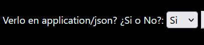

# LAB 3 AREP - MICROFRAMEWORKS - WEB

En este taller usted debe explorar la arquitectura del microframework WEB denominado sparkweb (https://sparkjava.com/). Este micro framework permite construir aplicaciones web de manera simple usando funciones lambda.

Su servidor debe:
Permite configurar servicios web de tipo GET y POST usando funciones lambda.
Entrega archivos estáticos como páginas HTML, CSS, JS e imágenes.
Permite configurar el directorio de donde se leerán los archivos estáticos.
Permite leer parámetros del query  desde los programas.
Adicionalmente:

Construya un ejemplo que muestre cómo de desarrollarían las aplicaciones en su servidor.
Pruebe su proyecto , e incluya una prueba de su proyecto corriendo en al menos dos sistemas operativos diferentes (Windows y linux)
## Reto

Para este ejercicio usted deb construir un  servidor web para soportar una funcionalidad similar a la de Spark. Su aplicación debe permitir por lo menos el registro de servicios get y post usando funciones lambda. Implemente igualmente funciones que le permitan configurar el directorio de los archivos estáticos, y otra que permita cambiar el tipo de la respuesta a "application/json". Para esto solo debe usar el API básico de Java. No utilice frameworks como Spark o Spring.

## Empezando

Estas instrucciones te permitirán obtener una copia del proyecto y ejecutarlo en tu máquina local con fines de desarrollo y pruebas. Consulta la sección de implementación para obtener notas sobre cómo desplegar el proyecto en un sistema en vivo.

### Prerequisitos

¿Qué cosas necesitas instalar para el software?

- Un navegador (preferiblemente Mozilla o Chrome).
- Un IDE como NetBeans para poder arrancar el servidor (Nota: Hay otras maneras).
- GitBash para clonar el proyecto en tu computadora.

### Instalación

Una serie de pasos a seguir para configurar un entorno de desarrollo.

1. Clonar este repositorio en tu computadora.
2. Encontrarás dos carpetas, server-web y client-web.
3. Puedes abrir server-web desde NetBeans y ejecutar main.java.
4. Abrir el cliente:
   - Si tienes una extensión en Visual Studio Code, puedes usarla para abrir un puerto y acceder a la página de la siguiente manera, por ejemplo: http://127.0.0.1:5500/index.html.
   - De manera más sencilla, simplemente abre index.html desde la carpte dandole ABRIR CON  en Mozilla o Chrome.

## Ejecución dEL PROGRAMA

Explica cómo ejecutarlo por medio de pruebas para mostrar su funcionamiento

### Desglose de pruebas de extremo a extremo

Explica qué prueban estas pruebas y por qué.

#### Pruebas con fundamentos de finalización

1. Archivo HTML (Lo mismo se replica en CSS y JS)

Si buscamos un recurso html con el get no lo vamos a encontrar ya que no ha sido guardado.

Lo podemos agregar

Podemos ver en la consola para mayor informacion

Si lo volvemos a buscar lo encotraremos y se mostrara en panalla

Si queremos verlo en application/json pasamos de NO -> SI

Y le damos al boton buscar por extension

Nota: Esto mismo se resume en los demas texto como css y js

2. Archivo PNG

Si buscamos un recurso png con el get no lo vamos a encontrar ya que no ha sido guardado.

Lo agregamos

Y lo podemos consultar y mostarlo comun y corriente

## Implementación

1. Con el metodo POST lo que hacemos es agregar el recurso y con el metodo GET lo que hacemos es buscar ese recurso y traerlo.
2. Con un select si o no preguntamos si queremos mostrar el application/json o simplemente ver el recurso comun y corriente.
3. Cmbiar el lugar donde se alamcenan los archivos con un input

## Construido con

- [Maven](https://maven.apache.org/) - Administración de dependencias
- [README](https://gist.github.com/PurpleBooth/109311bb0361f32d87a2) - Creé este README basado en la plantilla de https://gist.github.com/PurpleBooth.

## Autores

- **Daniel Esteban Perez Bohorquez**

## Licencia

Este proyecto está bajo la Licencia MIT. Consulta el archivo [LICENSE.md](LICENSE.md) para obtener más detalles.

## Agradecimientos

- Escuela Colombiana de Ingeniería
